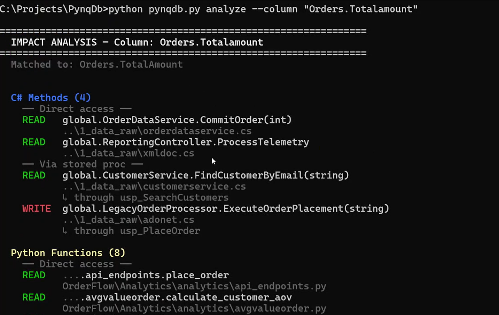
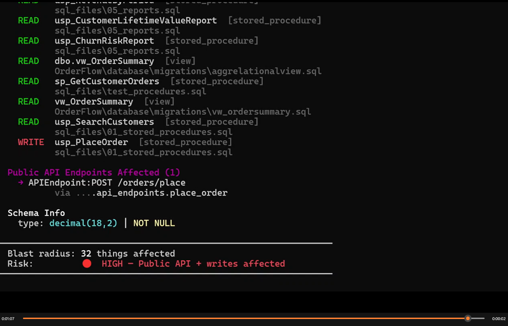
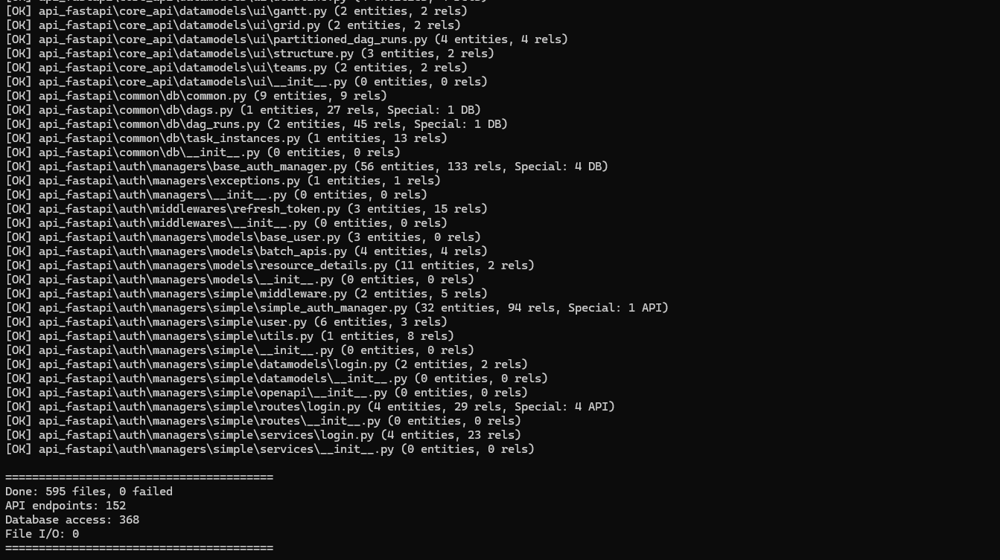
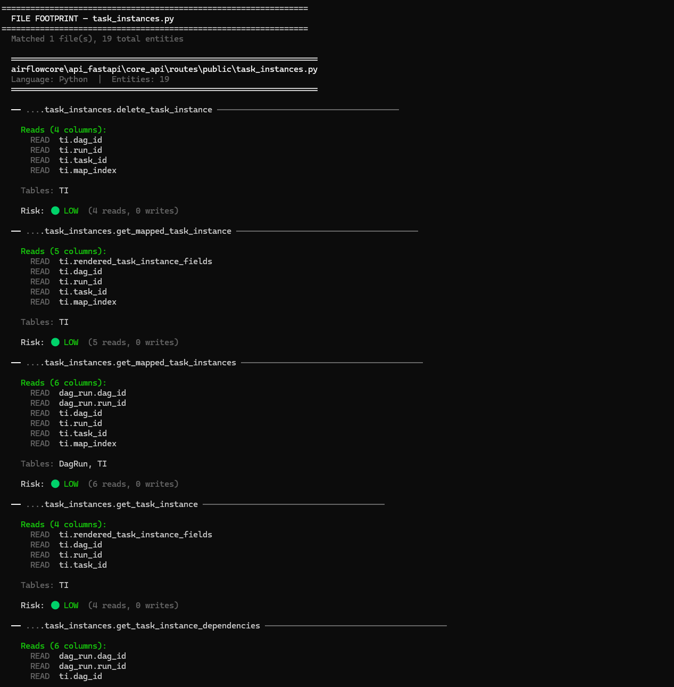

# PynqDB

C#. Python. SQL. Java. Know exactly what your code touches.

## What Is PynqDB?

PynqDB maps your entire codebase into a local dependency graph.

Ask it what uses a column. Ask it what a file touches. Get the 
answer in seconds. No AI. No cloud. Your code never leaves 
your machine.

## The Problem

You're about to change a database column. You grep the codebase. 
You find some results. You think you got everything.

You deploy. Three days later something breaks that you didn't 
know was connected.

That's not a skill problem. That's a visibility problem.

Code analysis tools stop at the code boundary — they don't know 
your stored procedures exist. Data lineage tools stop at the SQL 
boundary. Nothing connects both sides 
for small teams.

Until now.

Whether you're doing a schema change, database refactoring, 
or just trying to understand what uses a column — PynqDB 
gives you the answer in seconds.

## Two Commands. Complete Picture.

## What Makes PynqDB Different

### The Only Tool That Crosses Both Boundaries

Every other tool lives on one side of the database boundary.

- **Code analysis tools** — track function calls and file 
imports. They stop at the database wall. They don't know your 
stored procedures exist.

- **Data lineage tools** — track SQL flows. They stop at the 
application code wall. They cost $100,000/year.

**PynqDB crosses both.** The full chain — C# method through 
stored procedure to database column to Python analytics function 
to public API endpoint — visible in one query.

---

### What It Finds That Nothing Else Does

**SQL alias resolution**
`o.Status` in a Python f-string resolves to `Orders.Status` 
exactly. Not a guess. Not unknown. Exact. This is how every 
data team writes queries. Before PynqDB these accesses were 
invisible to every impact analysis tool.

**File footprint analysis**
Ask what one file does to your database. Three lines of C# 
traced through a stored procedure chain — 5 tables, 12 columns 
returned automatically.

**Schema change to API surface**
A decimal precision change on a column surfaces risk all the 
way up to public API endpoints. Nobody else connects these two 
layers automatically.

**Read vs Write distinction — cross-language**
Not just "this file touches that column." Which functions 
READ it. Which functions WRITE it. Across C#, Python, and SQL 
simultaneously.

**Undocumented column detection**
Columns written by production code but missing from your schema 
definition. Found automatically. No manual search required.

## Tested On Real Codebases
Ran PynqDB on five production-representative folders from 
Apache Airflow's open source codebase — 595 Python files, 
152 API endpoints, 368 database access points.

## What It Supports

**C#**
EF Core, Dapper, ADO.NET, raw SQL strings, stored proc calls,
XML doc comments, model attributes

**Python**
pandas, SQLAlchemy ORM and Core, psycopg2, cursor.execute,
f-string SQL queries, SQL alias resolution

**SQL**
Stored procedures, views, triggers, indexes, CTEs, JOINs,
MERGE statements

**Java**
JDBC, Spring Data, JPA/Hibernate

## Runs Locally. Always.

No cloud upload. No API calls. No data leaving your machine.
Your codebase, your schema, your dependency map — all local.
All private.

## No AI. Deterministic Results.

PynqDB uses static analysis. Not AI. Not an LLM.

Same input always produces the same output. No hallucinations.
No model drift. No token costs. No API keys. No surprises.

## Early Access

PynqDB is currently in private beta.

** Drop your public Repo. No credit card.**

→ [Join the Beta]((https://pynqdb.carrd.co))

Want to see your own codebase mapped before installing?
Drop a link to any public repository and we'll run PynqDB
on it and reply with your full dependency map.
No install needed on your end.

*"Run it on your codebase. Point it at any column , table , file"*

*C#. Python. SQL. Java. Know exactly what your code touches.*

